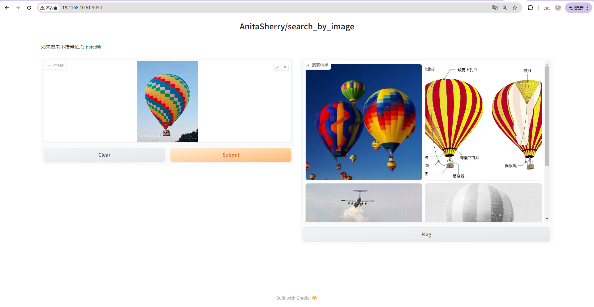

# 以图搜图

<p align="center">
• 🤖 <a href="https://modelscope.cn/models/iic/cv_resnest101_general_recognition/summary" target="_blank">ModelScope</a> • 📃 <a href="https://milvus.io/" target="_blank">Milvus</a>  
</p>


## 更新
### 2024/8/9
- 先抠图再识别

### 2024/8/8
- 添加选择数据库集合选项
- 添加可选择返回图片数量
- 添加可选择L2相似度阈值
- 添加config文件一键配置各个参数信息
- 添加requirements.txt文件一键配置环境
- 添加结果top文本描述信息
- 一键删除图片库

### 即将更新
- 集合分区
- 自动上传data目录中新添加的图片


## 介绍

本文档旨在介绍如何使用 ModelScope 中的通用领域模型（cv_resnest101_general_recognition）与商品显著性图像分割-电商领域模型（cv_vitb16_segmentation_shop-seg）以及搭配 Milvus 向量数据库实现以图搜图的功能。这项技术能够有效地从大量图片中迅速识别出与目标图片相似的图片，为图像检索任务提供了一种高效的解决方案

### Milvus

- **数据库类型：** Milvus 向量数据库
- **数据库特点：** Milvus 是一个开源的向量相似性检索引擎，专注于高性能的向量相似性搜索。它支持多种相似性搜索算法，并提供了可扩展的架构，适用于大规模的向量数据存储和检索。
- **数据库描述：** Milvus 向量数据库能够帮助用户轻松应对海量非结构化数据（图片/视频/语音/文本）检索。单节点 Milvus 可以在秒内完成十亿级的向量搜索，分布式架构亦能满足用户的水平扩展需求。

### cv_resnest101_general_recognition

- **模型名称：** cv_resnest101_general_recognition
- **模型类型：** 视觉分类
- **模型描述：** 该模型基于 ResNeSt101 架构，经过大规模数据集的预训练和精调，具有较强的图像识别能力。它能够识别通用领域中的各种物体、场景和图案

### cv_vitb16_segmentation_shop-seg

- **模型名称：** cv_vitb16_segmentation_shop-seg
- **模型类型：** 视觉分割
- **模型描述：** 模型结构为Denseclip结构，视觉encoder采用vit-base-patch16结构，经过40w商品显著性分割数据的预训练和精调，具有较强的图像分割能力。它能够识别商品场景，对通用场景效果较差，特殊领域物品建议不要使用

## 代码使用流程
```
# 拉取仓库
$ git clone https://github.com/AnitaSherry/search_by_Image.git

# 进入目录
$ cd search_by_Image
```
### 模型部署环境
下载anaconda3并安装
添加镜像源
```
conda config --add channels https://mirrors.tuna.tsinghua.edu.cn/anaconda/pkgs/main
conda config --add channels https://mirrors.tuna.tsinghua.edu.cn/anaconda/pkgs/free
conda config --add channels https://mirrors.tuna.tsinghua.edu.cn/anaconda/cloud/conda-forge
```
重新登陆一下服务器，初始化conda，并创建环境
```
conda init
conda create -n sakura python=3.10
```
安装环境所需包（NVIDIA显卡驱动[安装参考](https://blog.csdn.net/weixin_46398647/article/details/137666448?spm=1001.2014.3001.5502)）
```
pip install -r requirements.txt
```
其中mmcv包在[这里](https://download.openmmlab.com/mmcv/dist/cu121/torch2.3.0/index.html)下载
1. **下载模型：** 

   ```
   python model/modescope_model_init.py
   ```

   记录好模型下载后的路径，一般情况下模型路径为：

   ```
   Linux_ModelFile="/root/.cache/modelscope/hub/damo/cv_resnest101_general_recognition/pytorch_model.pt"
   Windows_ModelFile='C:\\Users\\Administrator\\.cache\\modelscope\\hub\\damo\\cv_resnest101_general_recognition\\pytorch_model.pt'
   ```
   将得到的路径记录下来，替换config.py代码中EMB的路径

2. **图像转向量并存入向量库：** 

   ```
   python Image_vectorization.py --data data
   ```
   如果使用图像分割，添加：--use_seg

   data目录中直接存放图片（data目录中可全部都是图片或分为几个子文件夹中存放图片，子文件夹即为milvus数据库中的集合）

   **注**：如果要删除这个向量数据库执行
   ```
   python milvus_manage/milvus_reduction.py
   ```

3. **前端搜索功能使用演示：** 

   ```
   python webui.py --server_port 9090
   ```
   如果使用图像分割，添加：--use_seg
   运行后访问 Running on local URL:  http://127.0.0.1:9090 即可使用

## 结果展示
   展示的时候如果你觉得速度慢，那是因为网速限制了图片从服务器传输到前端

   --use_seg 添加后相似度值会非常大，很难搜索到相似图片，这很正常



图像分割处理流程


<center>
最终用于进行相似度比对的图像
</center>

<center>
    
</center>

## Milvus部署及使用

```
mkdir Milvus
cd Milvus
wget https://github.com/milvus-io/milvus/releases/download/v2.4.1/milvus-standalone-docker-compose.yml -O docker-compose.yml
sudo docker-compose up -d
sudo docker-compose ps
```

通过命令查看显示信息如下

```
      Name                     Command                  State                            Ports
--------------------------------------------------------------------------------------------------------------------
milvus-etcd         etcd -advertise-client-url ...   Up (healthy)   2379/tcp, 2380/tcp
milvus-minio        /usr/bin/docker-entrypoint ...   Up (healthy)   0.0.0.0:9000->9000/tcp, 0.0.0.0:9001->9001/tcp
milvus-standalone   /tini -- milvus run standalone   Up (healthy)   0.0.0.0:19530->19530/tcp, 0.0.0.0:9091->9091/tcp
```

验证连接

```
docker port milvus-standalone 19530/tcp
```

停止Milvus

```
sudo docker-compose down
```

停止后删除数据

```
sudo rm -rf  volumes
```

### docker安装

```
sudo yum install docker
sudo systemctl start docker
sudo systemctl enable docker
sudo docker --version
```

输出示例
```
Docker version 18.09.0, build 172f8da
```
### docker-compose安装

```
curl -L "https://github.com/docker/compose/releases/download/1.29.2/docker-compose-$(uname -s)-$(uname -m)" -o /usr/local/bin/docker-compose
chmod +x /usr/local/bin/docker-compose
docker-compose -v
```

输出示例

```
docker-compose version 1.29.2, build unknown
```

### Milvus可视化工具Attu

```
docker run -p 8000:3000  -e MILVUS_URL=0.0.0.0:19530 zilliz/attu:dev
```
https://github.com/zilliztech/attu/issues/415
dev版本可以支持arrch昇腾服务器，本人和Attu官方人员沟通后得到版本，x86系统可以使用v2.3.8版本

#### 进入网页端

启动docker后，在浏览器中访问“http://{your machine IP}:8000”，点击“Connect”进入Attu服务

Milvus Address 填写{your machine IP}:19530

Milvus Database (optional) 如果创建过数据库直接填写数据库名称，如果没有填写default，创建一个名为default的数据库

Milvus Username (optional) 和 Milvus Password (optional) 无需填写，因为默认是关闭鉴权的

## Data数据示例

```
链接：https://pan.baidu.com/s/1eEDYq0oCBxmVRrIhophgCQ?pwd=c50e 
提取码：c50e
```

## 鼓励支持
 点个赞再走呗！比心💞️

## Star History
[](https://star-history.com/#AnitaSherry/search_by_Image&Date)
